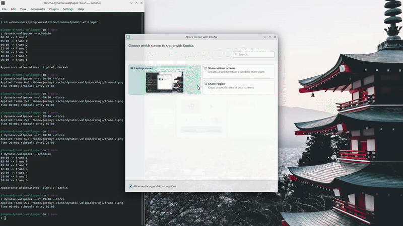

# Plasma Dynamic Wallpaper

[](https://github.com/dude297/plasma-dynamic-wallpaper/actions/workflows/ci.yml)
[](https://github.com/dude297/plasma-dynamic-wallpaper/releases)

> Use Apple's Dynamic Desktop HEIC wallpapers on KDE Plasma.


Bring Apple's Dynamic Desktop HEIC wallpapers to KDE Plasma.
Plasma Dynamic Wallpaper is one of the few Linux implementations that uses Apple's embedded apple_desktop:h24 metadata directly, preserving the original Dynamic Desktop schedule instead of approximating it.

## Features

- Apple Dynamic Desktop HEIC support
- Native `apple_desktop:h24` schedule decoding
- Automatic frame extraction and caching
- KDE Plasma integration
- Multi-monitor targeting by Plasma screen ID
- User-level systemd timer
- Skips redundant wallpaper updates
- CLI for inspection and testing
- No root required

## Requirements

Ubuntu/Kubuntu:

```bash
sudo apt install python3 libimage-exiftool-perl libheif-examples qdbus-qt6
```

Requires:

- Python 3
- exiftool
- heif-convert
- qdbus6
- systemd

## Easy installation

Install the stable package in an isolated environment with
`pipx`:

```bash
pipx install plasma-dynamic-wallpaper
dynamic-wallpaper --setup
```

Use `dynamic-wallpaper --setup-no-enable` when systemd files should be
installed without immediately enabling the timer. The source checkout
installer remains supported for development and offline installation.

## Installation

See the [complete installation guide](docs/installation.md) for requirements,
verification, updating, and removal.

```bash
git clone https://github.com/dude297/plasma-dynamic-wallpaper.git
cd plasma-dynamic-wallpaper

chmod +x install.sh
./install.sh

# Non-interactive install
./install.sh --yes

# Install files without enabling the timer
./install.sh --no-enable
```

Configure:

```bash
~/.config/dynamic-wallpaper/config
```

Example:

```bash
HEIC_FILE="$HOME/Pictures/DynamicWallpapers/Fuji/Fuji.heic"
CACHE_DIR="$HOME/.cache/dynamic-wallpaper/Fuji"

# Optional: update only selected Plasma screens
# By default, all currently active screens are detected automatically.
# Set SCREEN_IDS only to restrict updates to specific active Plasma screens.
# Temporarily disconnected screens are skipped and retried automatically.
# SCREEN_IDS=0,1
```

## Usage

```bash
dynamic-wallpaper                 # Apply wallpaper
dynamic-wallpaper --schedule      # Show Apple schedule
dynamic-wallpaper --config        # Show active configuration paths
dynamic-wallpaper --status        # Show last applied wallpaper
dynamic-wallpaper --current       # Compare schedule with active desktops
dynamic-wallpaper --cache-status  # Show cache freshness and frame count
dynamic-wallpaper --rebuild-cache # Force frame re-extraction
dynamic-wallpaper --inspect       # View decoded metadata
dynamic-wallpaper --extract       # Extract frames only
dynamic-wallpaper --dry-run       # Preview selected frame
dynamic-wallpaper --at 18:00 --dry-run
dynamic-wallpaper --force

# Managed local wallpapers
dynamic-wallpaper list
dynamic-wallpaper install ~/Pictures/DynamicWallpapers/Sonoma.heic
dynamic-wallpaper install ~/Pictures/Fuji.heic --name fuji
dynamic-wallpaper use fuji
dynamic-wallpaper remove fuji

# Remote wallpaper catalog
dynamic-wallpaper --library-list
dynamic-wallpaper --library-search mountain
dynamic-wallpaper --library-install WALLPAPER_ID
dynamic-wallpaper --library-installed
dynamic-wallpaper --library-remove WALLPAPER_ID
```

### Inspect active configuration

Show the configuration file and the resolved HEIC and cache paths:

```bash
dynamic-wallpaper --config
```

Primary information commands are mutually exclusive. For example,
`--status --schedule` is rejected instead of silently choosing one action.

### Manage the frame cache

Inspect cache freshness without modifying files:

```bash
dynamic-wallpaper --cache-status
```

Force a clean frame extraction when the HEIC was replaced without a detectable
timestamp change or cached output is suspected to be damaged:

```bash
dynamic-wallpaper --rebuild-cache
```

### Check installation health

Run the built-in readiness check before enabling the timer or when a scheduled
update fails:

```bash
dynamic-wallpaper --doctor
```

The command checks the Python version, required executables, configuration,
HEIC source file, and cache-directory readiness. It exits with status 1 when
any required check fails, so it can also be used in scripts.

## Multiple wallpapers

Local HEIC files can be imported into the managed per-user library. Each
wallpaper receives its own cache directory, while switching preserves settings
such as `SCREEN_IDS`:

```bash
dynamic-wallpaper install ~/Pictures/Fuji.heic --name fuji
dynamic-wallpaper install ~/Pictures/Sonoma.heic --name sonoma
dynamic-wallpaper list
dynamic-wallpaper use sonoma
dynamic-wallpaper --force
```

The active wallpaper is marked with `*` in `dynamic-wallpaper list`. The
currently active wallpaper cannot be removed until another one is selected.


## Systemd

The installer enables a user timer that checks the wallpaper every minute.
The service uses `--startup`, which waits for Plasma to expose an active desktop
before selecting the current time and force-applying the matching frame. This
avoids fixed-delay races during login. Failed one-shot runs are retried after
five seconds, and the one-minute timer reconciles Plasma configuration with the
current schedule after a shell crash, restart, monitor change, or resume.

```bash
systemctl --user status dynamic-wallpaper.timer
systemctl --user status dynamic-wallpaper-watch.service
systemctl --user start dynamic-wallpaper.service
journalctl --user -u dynamic-wallpaper.service -n 20
```

A lightweight user service watches the Plasma Shell D-Bus owner and a
suspend-aware session clock. When Plasma crashes or restarts, or when the
machine resumes after sleep, the watchdog asks systemd to run the synchronized
one-shot immediately instead of waiting for the next timer interval.

The same synchronization path can be tested manually:

```bash
dynamic-wallpaper --startup --verbose
```

## Project Layout

```text
plasma-dynamic-wallpaper/
├── bin/
├── config/
├── dynamic_wallpaper/
├── systemd/
├── install.sh
├── uninstall.sh
└── README.md
```

## Cache

```
~/.cache/dynamic-wallpaper/
```

The current wallpaper state is stored in:

```
~/.cache/dynamic-wallpaper/state.json
```

to avoid reapplying the same frame.

## Updating

```bash
git pull
./install.sh
```

## Uninstall

```bash
./uninstall.sh
```

User configuration and cache are preserved by default. To remove them too:

```bash
./uninstall.sh --purge
```

Both scripts prompt before making changes. Pass `--yes` for unattended use.
Existing configuration is backed up before every reinstall.

## Distribution

Stable releases are published as wheel and source distributions on GitHub and
PyPI. The recommended end-user installation is:

```bash
pipx install plasma-dynamic-wallpaper
dynamic-wallpaper --setup
```

The package can also be invoked without the console-script wrapper:

```bash
python -m dynamic_wallpaper --version
```

## Roadmap

- Curated wallpaper catalog growth
- Additional desktop environments
- Signed release artifacts
- Additional desktop backends

## License

Released under the MIT License.

## Command version

```bash
dynamic-wallpaper --version
```

## Documentation

- [Installation](docs/installation.md)
- [Troubleshooting](docs/troubleshooting.md)
- [Architecture](docs/architecture.md)
- [Testing, including live Plasma](docs/testing.md)
- [Release process](docs/release-process.md)
- [Wallpaper library](docs/wallpaper-library.md)

## Architecture

The CLI loads and validates configuration, then delegates orchestration to
`WallpaperEngine`. The engine coordinates four focused components:

1. `metadata.py` decodes Apple's embedded `apple_desktop:h24` data.
2. `cache.py` extracts HEIC frames and reuses a source-aware cache.
3. `metadata.py` persists decoded Apple metadata and invalidates it when the
   source HEIC changes.
4. `scheduler.py` maps the current time to the correct frame.
5. `plasma.py` applies the selected image through Plasma's D-Bus interface.

`state.py` records the last applied frame and UTC application time so routine
timer runs can avoid redundant desktop updates and `--status` can report the
last successful change.

## Development

Create an isolated environment and install the project with development tools:

```bash
python -m venv .venv
source .venv/bin/activate
python -m pip install --upgrade pip
python -m pip install -e ".[dev]"
```

Run the standard checks:

```bash
python -m ruff check .
python -m ruff format --check .
python -m pytest
python -m pytest --cov=dynamic_wallpaper --cov-report=term-missing
```

See [CONTRIBUTING.md](CONTRIBUTING.md) for package-build and pull-request
checks. Live desktop verification is documented in [docs/testing.md](docs/testing.md).

## Troubleshooting

See the [troubleshooting guide](docs/troubleshooting.md) for logging, cache,
systemd, D-Bus, and bug-report diagnostics.

### Configuration file not found

Create `~/.config/dynamic-wallpaper/config` from `config/config.example` and
confirm both required paths are set.

### `exiftool` or `heif-convert` not found

Install the Ubuntu/Kubuntu dependencies listed under Requirements, then verify:

```bash
exiftool -ver
heif-convert --help
```

### `qdbus6` not found or Plasma rejects the update

Confirm the command is installed and run the program from the active Plasma
user session. Inspect the service log with:

```bash
journalctl --user -u dynamic-wallpaper.service -n 50
```

### A wallpaper change is not detected

Run once with `--force`. If the source HEIC was replaced without its timestamp
changing, run `dynamic-wallpaper --rebuild-cache`.

## FAQ

### Does this modify the original HEIC file?

No. Frames and state are written only to the configured cache location.

### Does it require root access?

No. Installation, the systemd timer, cache, and Plasma update all run as the
current user.

### Why does the timer run every minute?

The embedded schedule selects discrete frames. Cached timer runs are lightweight,
and the shorter interval also acts as bounded automatic recovery after Plasma
Shell restarts, monitor changes, suspend, or resume. State reconciliation prevents
unnecessary reapplication when the desktop is already correct.

## Releases

Tagged releases are validated and published through GitHub Actions. Each
GitHub Release includes the installable wheel and source archive built from the
corresponding tag.

Release tags must exactly match the package version in `pyproject.toml`. For
example, package version `0.1.0` must use tag `v0.1.0`. The workflow also
requires a non-empty matching section in `CHANGELOG.md` and runs lint, tests,
coverage, build validation, and installed-command smoke tests before publishing.

PyPI publishing is not enabled yet. See [CONTRIBUTING.md](CONTRIBUTING.md) for
the maintainer release checklist.

### Diagnostic logging

Use `--verbose` to show detailed cache, frame-selection, Plasma DBus, and timing
information on stderr:

```bash
dynamic-wallpaper --force --verbose
```

Use `--log-file` to retain diagnostics across scheduled or manual runs. Parent
directories are created automatically:

```bash
dynamic-wallpaper --force --log-file ~/.local/state/dynamic-wallpaper/run.log
```

Combine both options to include debug details such as the exact Plasma script
and read-back response in the log file:

```bash
dynamic-wallpaper --force --verbose \
  --log-file ~/.local/state/dynamic-wallpaper/run.log
```
